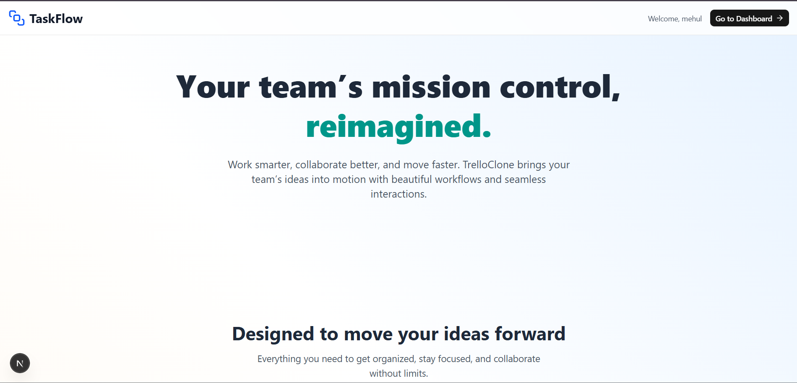
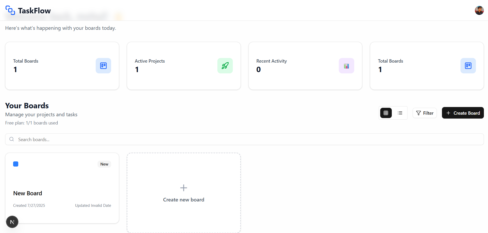
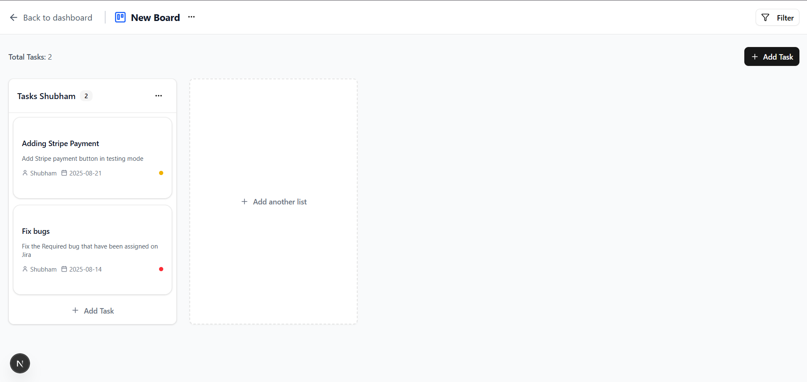

# TaskFlow (To-Do List)

## Description

TaskFlow is a modern, intuitive, and efficient task management application that helps users organize their workflow with ease. Built with Next.js and powered by Supabase for real-time database functionality, TaskFlow offers a Kanban-style board system to manage tasks with columns, status updates, and more. Authentication is seamlessly handled using Clerk for a secure and smooth user experience

## 📸 Screenshots

Explore TaskFlow’s clean and intuitive UI!

### **Home Page**


(./public/images/2.png)





## ✨ Features

- **Add Tasks:** Create new tasks with a title.
- **View Tasks:** Display a list of all tasks added by the user.
- **Edit Tasks:** Modify the details of existing tasks.
- **Delete Tasks:** Remove tasks that are no longer needed.
- **Mark Tasks as Complete:** Track progress by marking tasks as completed.
- **Responsive Design:** Optimized for both desktop and mobile devices.


## 🖥️ Tech Stack

- **Frontend:** JavaScript, TypeScript, Next JS, HTML, CSS, 
- **Backend:** Supabase (for managing boards, columns, tasks logic), Clerk (authentication)

## ⚙️ Setup Instructions

### Prerequisites

- Make sure you have the following installed:
- Node.js
- npm
- A Clerk account (for authentication)
- A Supabase project (for storing task/board/column data)


### Installation

1. **Clone the Repository:**
   ```bash
   git clone https://github.com/blasteroid24/TaskFlow.git

2. **Navigate to Repository**
    ```bash
    cd TaskFlow

3. **Install Node Modules**
    ```bash
    npm install

4. **Setup Environment Variables:**  
   - NEXT_PUBLIC_CLERK_PUBLISHABLE_KEY=<your-clerk-publishable-key>
   - CLERK_SECRET_KEY=<your-clerk-secret-key>
   - NEXT_PUBLIC_SUPABASE_URL=<your-supabase-url>
   - NEXT_PUBLIC_SUPABASE_ANON_KEY=<your-supabase-anon-key>

5. **Run project and start Development**
    ```bash
    npm run dev

6. **Access the Application:**  
   Open your browser and navigate to [http://localhost:3000](http://localhost:3000).


